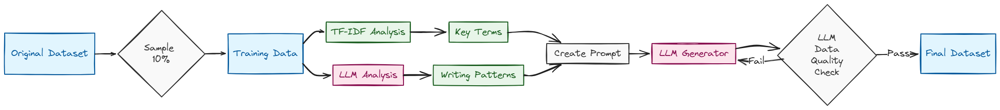

# Building LLM Agents From Scratch: Crafting a Dynamic NLP Data Generator 🤖

Have you ever wished you had more data for your NLP projects? Imagine having an AI helper to learn from your existing data and create more like it! Today, we will build precisely that - a basic but powerful AI agent that can generate synthetic data. And the best part? We'll build an agent from scratch using Python and the OpenAI API!

## What We're Building

Think of our AI agent as a clever student who:
1. First, learn by looking at your data (Learning Phase)
2. Then create new, similar data (Creation Phase)
3. Finally, checks if the new data is good enough (Validation Phase)

Let's break this down into simple steps and follow the chart below.



## The Learning Phase: Building a Smart Data Analyzer

Think of training an LLM agent, like teaching a friend to write viral content. As your friend would study successful viral posts to identify winning patterns, compelling tones, and key elements, our AI agent analyzes text to understand its characteristics.

`Setup your OpeAI APIs to run the below code.`

```python
from collections import Counter
import json
import os
import random
from typing import Dict, List, Optional

from openai import OpenAI
import pandas as pd
from sklearn.feature_extraction.text import TfidfVectorizer

api_key = "" # openai api key

def analyze_text_patterns_with_llm(client: OpenAI, texts: List[str], label: str) -> Dict:
    """
    Like a student taking detailed notes, this function uses an AI to analyze
    writing patterns in our sample texts
    """
    analysis_prompt = f"""
    Analyze the following {len(texts)} text samples for class '{label}' and identify their common patterns:

    Texts:
    {json.dumps(texts, indent=2)}

    Analyze and return a JSON object with these components:
    1. writing_style: List of identified writing styles (e.g., formal, casual, technical, emotional)
    2. semantic_patterns: List of semantic patterns (e.g., sentiment trends, topic focus, common themes)
    3. structural_patterns: List of sentence structure patterns (e.g., length, complexity)
    4. context_rules: List of contextual patterns and rules (e.g., typical scenarios, common subjects)

    Format your response as a JSON object with these exact keys.
    Be specific and detailed in your analysis.
    """
    
    response = client.chat.completions.create(
        model="gpt-4o",
        messages=[{
            "role": "system",
            "content": "You are an expert linguistic pattern analyzer that identifies detailed writing patterns and styles."
        },
        {
            "role": "user",
            "content": analysis_prompt
        }],
        response_format={ "type": "json_object" }
    )
    
    return json.loads(response.choices[0].message.content)

def analyze_class_patterns(client: OpenAI, texts: List[str], labels: List[str]) -> Dict:
    """
    Like organizing notes by topic, this function analyzes patterns for each type of text
    """
    # Figure out how many of each type we have
    class_distribution = Counter(labels)
    
    # Take a small sample from each type (10% of each class)
    samples_per_class = {}
    for label in set(labels):
        class_texts = [text for text, l in zip(texts, labels) if l == label]
        sample_size = max(1, int(len(class_texts) * 0.1))
        samples_per_class[label] = random.sample(class_texts, sample_size)
    
    # Find important words for each type using TF-IDF
    vectorizer = TfidfVectorizer(max_features=50)
    
    class_keywords = {}
    label_patterns = {}
    
    for label, class_texts in samples_per_class.items():
        if class_texts:
            # Get important words
            tfidf_matrix = vectorizer.fit_transform(class_texts)
            feature_names = vectorizer.get_feature_names_out()
            class_keywords[label] = list(feature_names)
            
            # Get AI analysis for this type
            llm_patterns = analyze_text_patterns_with_llm(client, class_texts, label)
            
            # Combine everything we learned
            label_patterns[label] = {
                'writing_style': llm_patterns['writing_style'],
                'key_phrases': class_keywords[label],
                'semantic_patterns': llm_patterns['semantic_patterns'],
                'structural_patterns': llm_patterns['structural_patterns'],
                'context_rules': llm_patterns['context_rules']
            }
    
    return label_patterns
```

## The Creation Phase: Implementing the Generation Engine

Now that our LLM agent understands the patterns, it's time to create new data! This is like asking our friend to write viral posts based on their learning.

```python
def generate_synthetic_samples(client: OpenAI, patterns: Dict, target_label: str, num_samples: int) -> List[str]:
    """
    Uses AI to generate new text samples based on what we learned
    """
    prompt = f"""
    You are a synthetic text generation expert. Generate {num_samples} new text samples 
    that match this class's patterns:

    1. Writing Style:
    {json.dumps(patterns['writing_style'], indent=2)}

    2. Key Phrases:
    {json.dumps(patterns['key_phrases'], indent=2)}

    3. Semantic Patterns:
    {json.dumps(patterns['semantic_patterns'], indent=2)}

    4. Structural Patterns:
    {json.dumps(patterns['structural_patterns'], indent=2)}

    5. Context Rules:
    {json.dumps(patterns['context_rules'], indent=2)}

    Requirements:
    - Generate completely unique and original texts
    - Maintain the identified patterns and style
    - Ensure natural language flow
    - Create diverse examples while staying within the class patterns
    - Avoid exact copying of training examples

    Return a JSON array with the structure:
        "samples": [
            "sample text 1",
            "sample text 2",
            ...
        ]
    """
    
    response = client.chat.completions.create(
        model="gpt-4o-mini",
        messages=[{
            "role": "system",
            "content": "You are a synthetic text generation expert that creates realistic but unique samples."
        },
        {
            "role": "user",
            "content": prompt
        }],
        response_format={ "type": "json_object" }
    )
    
    result = json.loads(response.choices[0].message.content)
    return result.get("samples", [])
```

## The Validation Phase: Ensuring Data Integrity and Quality

Finally, we need to check if our generated data is good enough - just like a guide would review our friend's viral posts!

```python
def validate_synthetic_sample(client: OpenAI, text: str, target_label: str, patterns: Dict) -> tuple[bool, list, list]:
    """
    Checks if our generated text matches the patterns we learned
    """
    prompt = f"""
    Validate if this synthetic text matches the patterns for class '{target_label}':
    
    Text to validate:
    {text}
    
    Expected Patterns:
    {json.dumps(patterns, indent=2)}
    
    Check for:
    1. Does it follow the identified writing style?
    2. Does it use appropriate key phrases?
    3. Does it match the semantic patterns?
    4. Does it follow structural patterns?
    5. Does it adhere to context rules?
    
    Return JSON with:
        "is_valid": true/false,
        "issues": ["issue1", "issue2", ...],
        "suggestions": ["suggestion1", "suggestion2", ...]
    """
    
    response = client.chat.completions.create(
        model="gpt-4o",
        messages=[{
            "role": "user",
            "content": prompt
        }],
        response_format={ "type": "json_object" }
    )
    
    result = json.loads(response.choices[0].message.content)
    return (
        result.get("is_valid", False),
        result.get("issues", []),
        result.get("suggestions", [])
    )

def augment_dataset(client: OpenAI, texts: List[str], labels: List[str], 
                   target_label: str, num_synthetic: int) -> tuple:
    """
    Creates a balanced dataset by adding synthetic samples
    """
    # First analyze patterns in the dataset
    patterns = analyze_class_patterns(client, texts, labels)
    
    # Generate synthetic samples
    synthetic_samples = []
    valid_count = 0
    
    while valid_count < num_synthetic:
        # Generate in batches of 10
        batch = generate_synthetic_samples(
            client,
            patterns[target_label], 
            target_label, 
            min(10, num_synthetic - valid_count)
        )
        
        for sample in batch:
            is_valid, issues, suggestions = validate_synthetic_sample(
                client,
                sample, 
                target_label,
                patterns[target_label]
            )
            if is_valid:
                synthetic_samples.append(sample)
                valid_count += 1
                if valid_count >= num_synthetic:
                    break
    
    # Combine with original dataset
    augmented_texts = texts + synthetic_samples
    augmented_labels = labels + [target_label] * len(synthetic_samples)
    
    return augmented_texts, augmented_labels
```

## Putting It All Together

Let's integrate these components and test our system with a smaller dataset. While we're using a sample size for this demonstration, it will effectively showcase the pipeline's capabilities while being mindful of API usage. This approach allows us to validate our methodology before scaling to larger datasets:

```python
# Setup OpenAI client
client = OpenAI(api_key=api_key)

# Sample movie reviews
sample_reviews = [
    "This movie was absolutely fantastic! Great acting and wonderful plot.",
    "Decent film but the pacing was a bit slow. Good performance by the lead actor.",
    "Not worth the ticket price. Poor storyline and mediocre acting.",
    "A masterpiece of modern cinema. Every scene was perfectly crafted."
]

# Sample labels
sample_labels = ["positive", "neutral", "negative", "positive"]

# Let's say we want to generate more neutral reviews to balance our dataset
print("📚 Analyzing original data...")

# Find out how many samples we need
label_counts = Counter(sample_labels)
desired_samples = max(label_counts.values())
target_label = "neutral"
synthetic_needed = desired_samples - label_counts[target_label]

print(f"🤖 Generating {synthetic_needed} new {target_label} reviews...")

# Generate balanced dataset
augmented_texts, augmented_labels = augment_dataset(
    client=client,
    texts=sample_reviews,
    labels=sample_labels,
    target_label=target_label,
    num_synthetic=synthetic_needed
)

print("\nOriginal Distribution:", dict(Counter(sample_labels)))
print("New Distribution:", dict(Counter(augmented_labels)))
    
print(f"Augmented text:\n{list(set(augmented_texts) - set(sample_reviews))}")
```

#### Output
```python
Augmented text:
[
    "The lead actor's performance was solid, but the film had some slow pacing that dragged it down a bit."
]
```

## What's Next?

We've just built our own LLM-powered synthetic data generation agent. This is just the beginning - we can enhance it by:

1. Running the complete pipeline on a real-world dataset 
2. Adding more analysis metrics (topic detection)
3. Implementing different validation techniques
4. Replace the sample examples with real-world dataset
5. Implementing a production Synthetic Data generation agent by leveraging [Argilla](https://argilla.io/)
6. Going beyond OpenAI models and experimenting with Deepsek-v3

The possibilities are endless! Attaching the [jupyter notebook](https://github.com/Praneeth16/articles/blob/main/agents-from-scratch/synthetic_agent_from_scratch.ipynb) to play around.

## Final Thoughts

We have created a simple agent from scratch by breaking it down into - learning, creating, and validating. We have created a small but useful tool for synthetic data generation. Happy generating! 🚀
